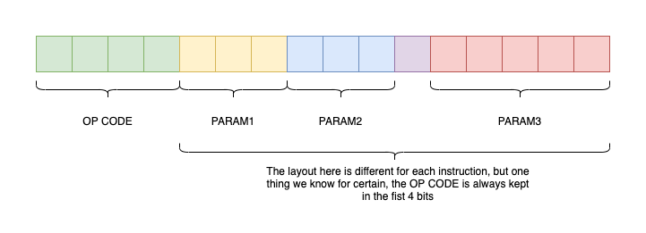

# LC-3 Virtual Machine

This program is a virtual machine
for the LC-3 architecture.
this project was based in these
articles: [one](https://www.andreinc.net/2021/12/01/writing-a-simple-vm-in-less-than-125-lines-of-c#virtual-machines), [two](https://www.jmeiners.com/lc3-vm/)

## The LC-3 architecture

The Little Computer 3 or LC-3 is a
simple, 16 bit architecture, used principally
for teaching computer science and low level programming.

The LC-3 have 10 16-bit registers,
8 for general purpose (R0 ... R7),
Program Counter Register (RPC),
and CPU Flag Register (RCND).  

It supports the operations of ADD,
bitwise AND and NOT with 16 bit integers,
all data is supposed to be stored with two's
complement.

It ALU have three flags, Positive(1), Zero(2), Negative(4)

It have a 128KB of memory, separated in 64K words, the
origin address for writing programs, by default, is 0x3000.

## Instruction set

the general syntax of the instructions are:

<table>
    <tr>
        <th>Instruction</th>
        <th>OPCode(hex)</th>
        <th>OPCode(bin)</th>
        <th>Syntax</th>
        <th>Function</th>
    </tr>
    <tr>
        <td>BR</td>
        <td>0x0</td>
        <td>0b0000</td>
        <td>0000|NZP3|OFF9</td>
        <td>Conditional branch</td>
    </tr>
    <tr>
        <td>ADD1</td>
        <td>0x1</td>
        <td>0b0001</td>
        <td>0001|DR1(3)|SR1(3)|000|SR2(3)</td>
        <td>Add operation with SR1 and SR2</td>
    </tr>
    <tr>
        <td>ADD2</td>
        <td>0x1</td>
        <td>0b0001</td>
        <td>0001|DR1(3)|SR1(3)|1|IMM5</td>
        <td>Add operation with SR1 and IMM</td>
    </tr>
    <tr>
        <td>LD</td>
        <td>0x2</td>
        <td>0b0010</td>
        <td>0010|DR1(3)|OFF9</td>
        <td>Load in DR1 RPC + OFFSET</td>
    </tr>
    <tr>
        <td>ST</td>
        <td>0x3</td>
        <td>0b0011</td>
        <td>0011|SR(3)|OFF9</td>
        <td>Store RPC + OFFSET</td>
    </tr>
    <tr>
        <td>JSR</td>
        <td>0x4</td>
        <td>0b0100</td>
        <td>0100|1|OFF11</td>
        <td>Jump To subroutine(RPC + OFFSET)</td>
    </tr>
    <tr>
        <td>JSRR</td>
        <td>0x4</td>
        <td>0b0100</td>
        <td>0100|000|BASER3|000000</td>
        <td>Jump to subroutine(address in BASER,Base Register)</td>
    </tr>
    <tr>
        <td>AND1</td>
        <td>0x5</td>
        <td>0b0101</td>
        <td>0101|DR1(3)|SR1(3)|000|SR2(3)</td>
        <td>Bitwise and</td>
    </tr>
    <tr>
        <td>AND2</td>
        <td>0x5</td>
        <td>0b0101</td>
        <td>0101|DR1(3)|SR1(3)|1|IMM5</td>
        <td>Bitwise and</td>
    </tr>
    <tr>
        <td>LDR</td>
        <td>0x6</td>
        <td>0b0110</td>
        <td>0110|DR1(3)|BASER3|OFF6</td>
        <td>Load in DR1 BASER + OFFSET</td>
    </tr>
    <tr>
        <td>STR</td>
        <td>0x7</td>
        <td>0b0111</td>
        <td>0111|DR1(3)|BASER3|OFF6</td>
        <td>Store DR1 to address BASER + OFFSET</td>
    </tr>
    <tr>
        <td>RTI</td>
        <td>0x8</td>
        <td>0b1000</td>
        <td>Not Implemented</td>
        <td>Return from interruption</td>
    </tr>
    <tr>
        <td>NOT</td>
        <td>0x9</td>
        <td>0b1001</td>
        <td>1001|DR1(3)|SR1(3)|111111</td>
        <td>Bitwise not</td>
    </tr>
    <tr>
        <td>LDI</td>
        <td>0xA</td>
        <td>0b1010</td>
        <td>1010|DR1(3)|OFF9</td>
        <td>Load in DR1 data in address stored in RPC + OFFSET</td>
    </tr>
    <tr>
        <td>STI</td>
        <td>0xB</td>
        <td>0b1011</td>
        <td>1011|SR(3)|OFF9</td>
        <td>Store SR to address stored address RPC + OFFSET</td>
    </tr>
    <tr>
        <td>JMP</td>
        <td>0xC</td>
        <td>0b1100</td>
        <td>1100|000|BASER3|000000</td>
        <td>Jump to address in Baser(Base register)</td>
    </tr>
    <tr>
        <td>RES</td>
        <td>0xD</td>
        <td>0b1101</td>
        <td>1101|000000000000</td>
        <td>Not exist in oficial LC-3, Reset CPU</td>
    </tr>
    <tr>
        <td>LEA</td>
        <td>0xE</td>
        <td>0b1110</td>
        <td>1110|DR1(3)|OFF9</td>
        <td>Load Effective Address(Loads the Address of RPC + OFFSET to DR1)</td>
    </tr>
    <tr>
        <td>TRP</td>
        <td>0xF</td>
        <td>0b1111</td>
        <td>1111|0000||TRPVECT8</td>
        <td>Trap, executes built-in function based in TRPVECT</td>
    </tr>
</table>

### Trap Vector

The Trap(TRP) operation is used for I/O and exiting the program,
what it do is based in it only 8bit argument, TRPVECT, in this VM,
there is 10 subroutines for TRPVECT:

<table>
    <tr>
        <th>Trap Function</th>
        <th>TRPVECT</th>
        <th>Function</th>
    </tr>
        <td>trpgetc</td>
        <td>0x20</td>
        <td>Reads a char from the keyboard and store it in R0</td>
    </tr>
    <tr>
        <td>trpout</td>
        <td>0x21</td>
        <td>Prints the char stored in R0 to the console</td>
    </tr>
    <tr>
        <td>trpputs</td>
        <td>0x22</td>
        <td>Prints a string to the console, strings are characters
         in contiguous memory locations,with it start address being stored in R0, and it end
         being a '\0' char</td>
    </tr>
    <tr>
        <td>trpin</td>
        <td>0x23</td>
        <td>Reads a char from the keyboard, store it in R0 and print it in
        the console</td>
    </tr>
    <tr>
        <td>trpputsp</td>
        <td>0x24</td>
        <td>Prints a string of packed chars to the console, strings are characters
         in contiguous memory locations,with it start address being stored in R0, and it end
         being a '\0' char, packed chars are two chars in only one memory cell, in LC-3, it's a
         word(2 bytes)</td>
    </tr>
    <tr>
        <td>trphlt</td>
        <td>0x25</td>
        <td>Halts the code, end the VM</td>
    </tr>
    <tr>
        <td>trpin16</td>
        <td>0x26</td>
        <td>Reads a word from the keyboard and store it in R0
        </td>
    </tr>
    <tr>
        <td>trpoutu16</td>
        <td>0x27</td>
        <td>Prints the unsigned word stored in R0 to the console</td>
    </tr>
    <tr>
        <td>trpouti16</td>
        <td>0x28</td>
        <td>Prints the signed word stored in R0 to the console</td>
    </tr>
    <tr>
        <td>trpputsc</td>
        <td>0x29</td>
        <td>Prints a colored string to the console, strings are characters
         in contiguous memory locations,with it start address being stored in R0, and it end
         being a '\0' char, the colors, text color and background color, are stored in the
         upper byte, each occupying a nibble(4 bits),the first, the colors supported are the
         8 basic ASCII colors, the first nibble is the text color,the second is the background color.
         (obs: the first nibbles is the nibble with the lower values[8-11],and the second is the nibble
         with the upper values[12-15])
         </td>
    </tr>
</table>

### trpputsc Colors

<table>
    <tr>
        <th>Color</th>
        <th>ASCII Code(text/background)(dec)</th>
        <th>VM Machine Code(hex)</th>
    </tr>
    <tr>
        <td>Black</td>
        <td>30/40</td>
        <td>0x0</td>
    </tr>
    <tr>
        <td>Red</td>
        <td>31/41</td>
        <td>0x1</td>
    </tr>
    <tr>
        <td>Green</td>
        <td>32/42</td>
        <td>0x2</td>
    </tr>
    <tr>
        <td>Yellow</td>
        <td>33/43</td>
        <td>0x3</td>
    </tr>
    <tr>
        <td>Blue</td>
        <td>34/44</td>
        <td>0x4</td>
    </tr>
    <tr>
        <td>Magenta</td>
        <td>35/45</td>
        <td>0x5</td>
    </tr>
    <tr>
        <td>Cyan</td>
        <td>36/46</td>
        <td>0x6</td>
    </tr>
    <tr>
        <td>White</td>
        <td>37/47</td>
        <td>0x7</td>
    </tr>
</table>

## VM Features

### Special params

You can specify some special params
to the VM, the params are typed
after the program. `lc3-vm [program] [--params]...`

#### --help

This param is _special_, it's different from
the other params, it doesn't changes anything in
the VM run, it doesn't even runs a programs, --help
is typed in the place of the program and it prints
a little description of all special param covered in
this section.

`lc3-vm --help`

#### --runoff

This param set the offset of the PC start value.
The initial value of PC 0x3000 + runoff(0x), by default runoff
is zero, this params changes it.

`lc3-vm program.o --runoff A1`
this changes the start PC value
for 0x30A1

#### --loadoff

This param set the offset of the program loading
origin. The programs are written starting in
0x3000 + loadoff(0x), by default loadoff is zero,
this param changes it.

`lc3-vm program.o --loadoff FF`
this changes the load program origin
to 0x30FF

! WARNING ! : the runoff doesn't changes with loadoff, pay attention where
your program begins

#### --memrep

This param prints creates two
logs of the memory, one before the
program run, and another after the program run.

`lc3-vm program.o --memrep`
this will generate this two files
.\\
 | lc3-vm.exe
 | memory\_reports\_[DAY-MONTH-YEAR]\_[HOUR-MIN-SEC]\_final.log
 | memory\_reports\_[DAY-MONTH-YEAR]\_[HOUR-MIN-SEC]\_init.log
